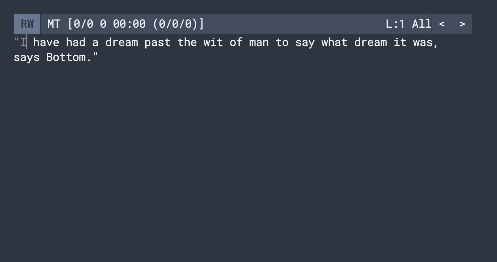

## Monkeytype on GNU Emacs / N Λ N O

**This is a fork of GNU Emacs / N Λ N O meant for [Monkeytype](https://github.com/jpablobr/emacs-monkeytype)**

To run it clone this repository and from inside run the following in
your terminal:

```
$ emacs -q -l monkeytype.el
```
To start _monkeytyping_ execute **M-x monkeytype-fortune** or any of
the other commands listed in the Monkeytype's repository.

The `monkeytype.el` file has a basic [Emacs Monkeytype
](https://github.com/jpablobr/emacs-monkeytype) configuration and at
the end it also loads a `monkeytype.local.el` file (if it exists)
for custom configuration (keybindings, functions, etc.**.

Here's an example of further configuration meant for the
`monkeytype.local.el` file:

```elisp
;; Reset some of Emacs N Λ N O defauls

(setq ns-use-native-fullscreen t
      mac-option-key-is-meta nil
      mac-command-key-is-meta nil
      mac-command-modifier 'control
      mac-option-modifier 'meta
      mac-use-title-bar nil
      ;; http://irreal.org/blog/?p=1450
      mac-function-modifier 'hyper)

(setq default-frame-alist
      (append (list
	       '(font . "Roboto Mono:style=Light:size=20")
	       ;; '(font . "Roboto Mono Emacs Regular:size=14")
	       '(min-height . 1)  '(height     . 45)
	       '(min-width  . 1) '(width      . 81)
               '(vertical-scroll-bars . nil)
               '(internal-border-width . 24)
               '(left-fringe    . 0)
               '(right-fringe   . 0)
               '(tool-bar-lines . 0)
               '(menu-bar-lines . 0))))

;; Custom monkeytype functions
;;;###autoload
(defun monkeytype-pangrams ()
  "Monkeytype most common pangrams randomised."
  (interactive)
  (monkeytype--init
   (mapconcat
    #'identity
    (monkeytype--utils-nshuffle
     '(
       "Jived fox nymph grabs quick waltz"
       "Glib jocks quiz nymph to vex dwarf"
       "How vexingly quick daft zebras jump!"
       "The five boxing wizards jump quickly"
       "Sphinx of black quartz, judge my vow"
       "Waltz, bad nymph, for quick jigs vex"
       "Jackdaws love my big sphinx of quartz"
       "Pack my box with five dozen liquor jugs"
       "The quick brown fox jumps over the lazy dog"))
    "\n")))

(global-set-key (kbd "C-c C-c j") #'monkeytype-pangrams)

(monkeytype-pangrams)

(provide 'monkeytype.local)
```

## Screencast Demo



## Alternative Running Methods

The `nano-monkeytype.bash` script allows to run nano-monkeytype from
any directory if the `NANO_MONKEYTYPE_DIR` environment variable exists
and points to the repository's directory, and the scrip has been added
to somewhere in your `$PATH` (you can link it with: `ln -s
/path/to/nano-monkeytype.bash /your/bin/dir/nano-monkeytype`)

### 1) Adding `NANO_MONKEYTYPE_DIR` environment variable

Set the `NANO_MONKEYTYPE_DIR` environment variable in your `.bashrc`
or `.zshrc`:

```bash
export NANO_MONKEYTYPE_DIR="/path/to/repo"
```
And just run the script `nano-monkeytype.bash`.

### 2 One liner

It is also possible to run the script like this:

```bash
exec env NANO_MONKEYTYPE_DIR="/path/to/repo" monkeytype.bash
```
And maybe add an alias to it.

### 3 From Emacs

Add the following to your `.emacs`:

```elisp
(defun my/run-nano-monketype ()
  (interactive)
  (setenv "NANO_MONKEYTYPE_DIR" "/path/to/repo")
  (shell-command-to-string "monkeytype -dark"))

(global-set-key (kbd "My-Key-binding") #'my/run-nano-monkeytype)
```

**For more specifics about this N Λ N O Emacs configuration***, the
following is an excerpt of the project's README but for more info here
you can find the project's original repository:

https://github.com/rougier/nano-emacs

**GNU Emacs / N Λ N O** is a set of configuration files for GNU Emacs
such as to provide a nice and consistent look and feel as shown below.
It is based on design principles I described in the article "[On the
design of text Editors](https://arxiv.org/abs/2008.06030)" that is
available on arXiv. The light theme is based on [Material
colors](https://material.io/) and the dark theme is based on [Nord
colors](https://www.nordtheme.com/).

The philosophy of nano emacs is to stick as much as possible to
vanilla emacs without introducing too much dependencies (or none if
possible) and to keep it modular enough. The idea is for users to copy
the part they are interested in such as to include them in their own
configuration.

<div>


</div>

### Requirements

You need a recent version of
[GNU Emacs](https://www.gnu.org/software/emacs/) and to have the
[Roboto Mono](https://fonts.google.com/specimen/Roboto+Mono) and
[Fira Code](https://fonts.google.com/specimen/Fira+Code) fonts
installed on your system. There are no other dependencies.
